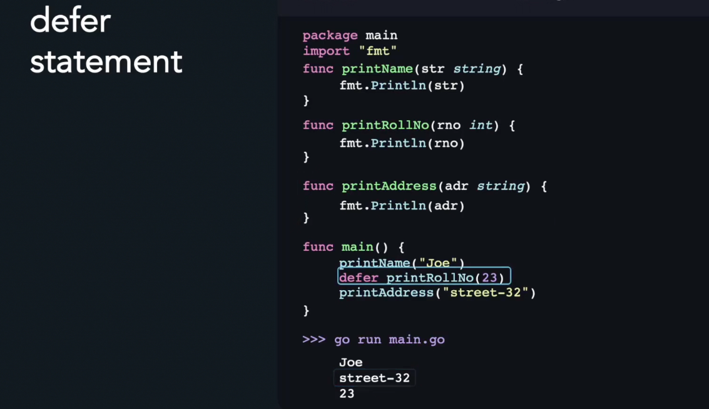
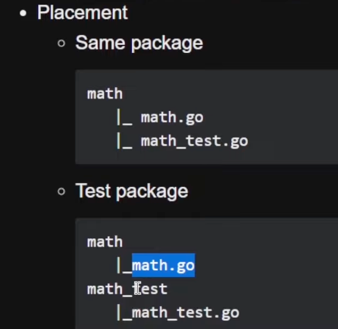
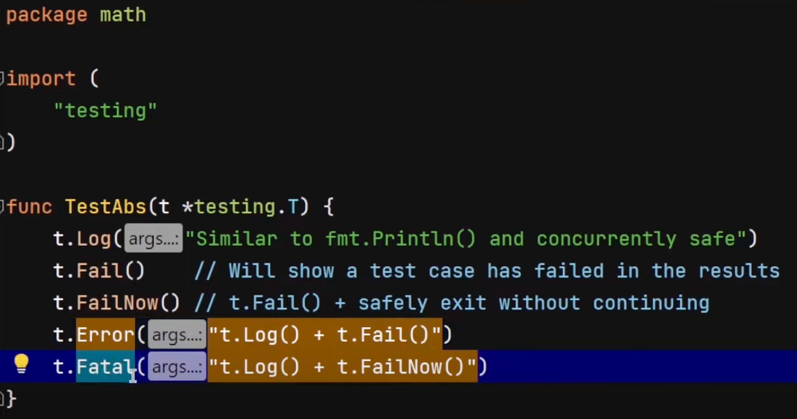
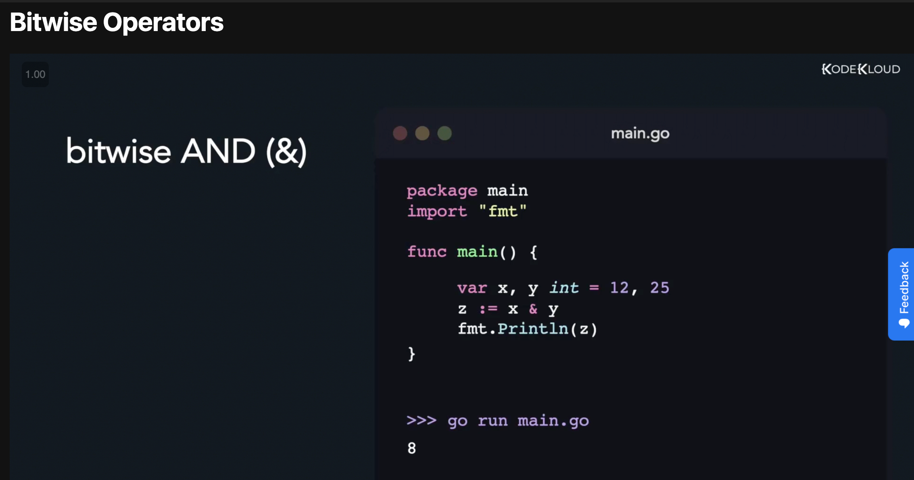
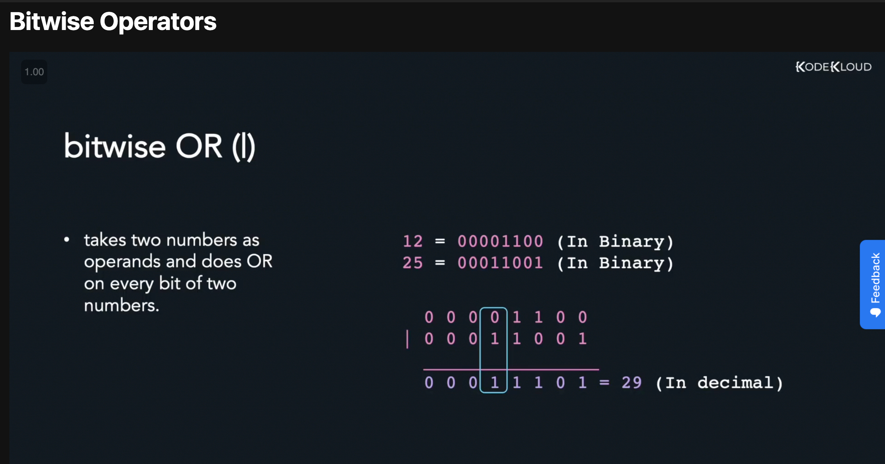
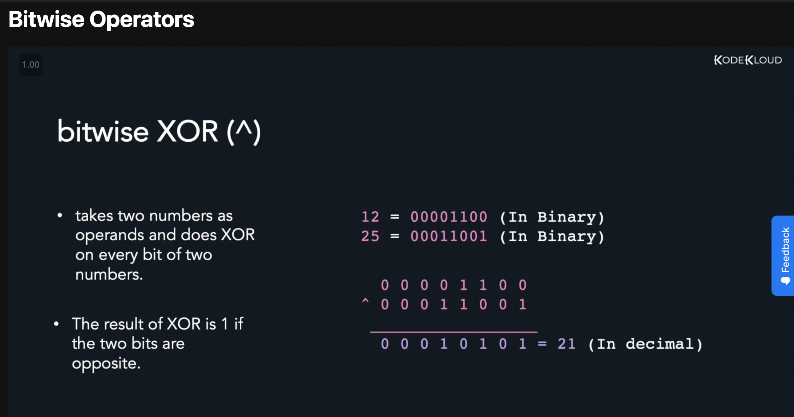
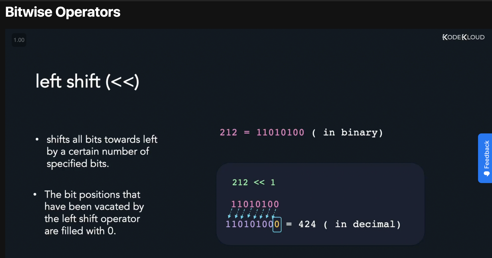
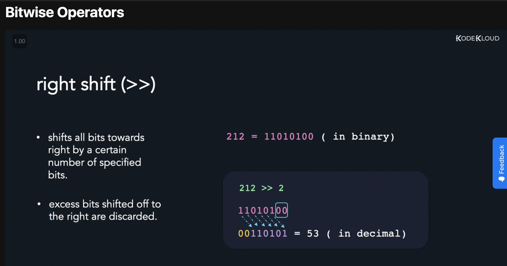
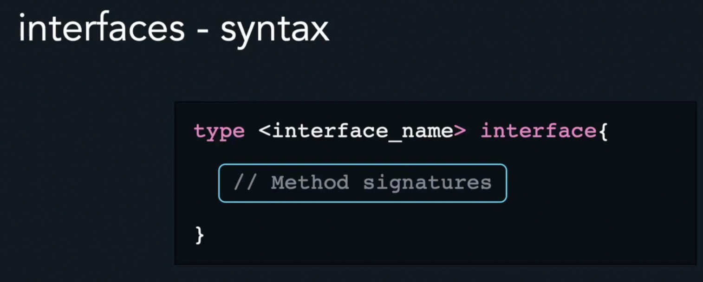

# Go intro

### Welcome to the phone book application
#### Creates a simple cli application that request info from user and stores it into several data types.
The main purpose is to learn golang.

———————————————————————————
## Packages (library)
The package name is the same as the last element of the import path.
For instance, the `"math/rand"` package comprises files that begin with the statement package rand.
Name is exported if it begins with a capital letter for example `math.Pi` and not `math.pi`.

```go
package main
import (
	"math/rand"
	"fmt"
) 
func main() {
	fmt.Print(rand.New(rand.NewSource(99)))
}
```
———————————————————————————

## Variables
You can define a variable and then the type

for example:


`var x int, y int`

When you define more that one variable that have that same type you can omit the type, for example:
In this example, we shortened
`var x int, y int`

to

`var x, y int`

———————————————————————————

You can declare a list of variables

For example:
```go
package main
import "fmt"
func main() {
	var c, python, java bool
	fmt.Println(c, python,java)
}
```
———————————————————————————

Var declaration can include initializers

For example:
```go
package main
import "fmt"
func main() {
	var i, j int = 1, 2
	fmt.Println(i, j)
}
```
———————————————————————————

If an initializer is present, the type can be omitted:
For example:
```go
package main
import "fmt"
func main() {
	var c, python, java = true, false, "no!"
	fmt.Println(c, python, java)
}
```
———————————————————————————

The := short assignment statement can be used in place of a var declaration.
```go
package main
import "fmt"
func main() {
	var i, j int = 1, 2
	k := 3
	c, python, java := true, false, "no!"

	fmt.Println(i, j, k, c, python, java)
}
```
———————————————————————————

Go's basic variables types are:
* `bool`

* `string`

*  ```
   int  int8  int16  int32  int64
   uint8 uint16 uint32 uint64 uintptr
   ```

*  `byte // alias for uint8`

*  `rune // alias for int32
   // represents a Unicode code point`

* `float32 float64`

* `complex64 complex128`

———————————————————————————

Variables declared without an explicit initial value are given their zero value.
The zero value is:

•	0 for numeric types,

•	false for the boolean type, and

•	"" (the empty string) for strings.

———————————————————————————

The expression T(v) converts the value v to the type T.
Some numeric conversions:
```go
package main
import "fmt"
func main() {
	var i int = 42
	var f float64 = float64(i)
	var u uint = uint(f)
	fmt.Print(i, f, u)
}
```

———————————————————————————

When declaring a variable without specifying an explicit type the variable's type is inferred from the value on the right hand side.

For example:

```go
package main
import "fmt"
func main() {
	j := i
	fmt.Print(j, i)
}
```
———————————————————————————
### The `==`  vs `=` sign
* `=` is for assigning values to variables
* `==` is for comparing 2 values
  ———————————————————————————
## Constants

Constants are declared like variables, but with the const keyword.
Constants can be character, string, boolean, or numeric values.
Constants **cannot** be declared using the `:=` syntax.
The difference Constants and variables that **Constants cant be changed**
For example:
```go
package main
import "fmt"
const Pi = 3.14
func main() {
	const World = "世界"
	fmt.Println("Hello", World)
	fmt.Println("Happy", Pi, "Day")

	const Truth = true
	fmt.Println("Go rules?", Truth)
}
```
———————————————————————————
### Numeric constants
Numeric constants are high-precision values.
An untyped constant takes the type needed by its context.
```go
package main
func main() {
	const (
		// Shift 1 in binary (0001) left 2 places, so we end up with (0100)  which is 4 in decimal.
		Big = 1 << 2
		// Shift it right again 99 places, so we end up with 1<<1, or 2.
		Small = Big >> 99
	)
}
````
———————————————————————————
## If
Go has only one looping construct, the **for** loop.
The basic for loop has three components separated by semicolons:
• the **init** statement: executed before the first iteration
• the **condition** expression: evaluated before every iteration
• the **post** statement: executed at the end of every iteration
The init statement will often be a short variable declaration, and the variables declared there are visible only in the scope of the for statement.
The loop will stop iterating once the boolean condition evaluates to false.

`for {}`


```go
package main
import "fmt"
func main() {
	sum := 0
	for i := 0; i < 10; i++ {
		sum += i
	}
	fmt.Println(sum)
}
```
———————————————————————————

If you omit the **loop** condition it loops forever, so an infinite loop is compactly expressed.
```go
package main
func main() {
	for {}
}
```
———————————————————————————
## For
If you write a for loop without semicolon it then gets like a **for** loop
```go
package main
import "fmt"
func main() {
	sum := 1
	for sum < 1000 {
		sum += sum
	}
	fmt.Println(sum)
}
```
———————————————————————————
## break
You can break `for` loop using `break`

```go
package main
import "fmt"
func main() {
	var black bool = false
	var painting_needed bool
	for black == true {
		fmt.Print("Black is true")
		if painting_needed == false {
			fmt.Print("Painting is not needed exiting..")
			break
		}
	} 
	
}
```
———————————————————————————
## continue
You can also use `continue` to skip the remainer of the `for` loop and restart the condition
```go
package main
import "fmt"
func main() {
	var black bool = false
	var painting_needed bool
	for black == true {
		fmt.Print("Black is true")
		if painting_needed == true {
			fmt.Print("Painting is needed")
			continue
		}
	}
}
```
———————————————————————————
## if else
You can create another if by using the `if else` function.
You can have unlimited number of if else statements

```go
package main
import "fmt"
func main() {
	var color string = "Blue"
	if color == "black" {
		fmt.Print("Black is black")
	} else if color == "Blue" {
		fmt.Print("Black is black")
	} else {
		fmt.Print("Color is either black or blue")
	}
}
```
———————————————————————————
## Maps
You can create a map ( key, value ) in go like this

```go
package main
import "fmt"
func main() {
	var userdata = make(map[string]float64)
	fmt.Print(userdata)
}
```

You can create and initialize a map like that will create a map with a key string and value float64
```go
package main
import "fmt"
func main() {
	// Creates a map with keys - strings and values - float64
	var menu map[string]float64
	// Initialize the map 
	menu = make(map[string]float64)
	menu["item1"] = 10.99
	for key, value := range menu {
		fmt.Printf("Your map key is %s and value is %f\n", key, value)
	}
}
```
In maps, you cant mix data types in the key and values.
If you have to use maps, and you have a integer you can convert it to a string or other data type see (strconv.FormatUnit)
———————————————————————————
## Pointer
Variables are stored in memory and to access them go uses pointers that are referenced like this &<var_name>

```go
package main
import "fmt"
func main() {
	var hobby string
	fmt.Scanln(&hobby)
}
```
This function scans from a user input into this variable called hobby by using the pointer &hobby

You can also print the actual value by using astrix (*)

```go
package main

import "fmt"

func main() {
     var hobby string
     fmt.Scanln(&hobby)
     actualValue := &hobby
     fmt.Println("value", *actualValue)
}
```
———————————————————————————
## Array
You can create an array like this:

```go
package main
import "fmt"
func main () {
	var booking = [50]string{"dsf", "gfg"}
	fmt.Print(booking)
}
```
Creates an array of strings called booking with 50 indexes

To add an element to the array you can use

```go
package main
func main () {
	name := "John"
	booking :=[10]string{}
	booking[1] = name
}
```
This will add name variable to the index 1 in the booking array
———————————————————————————
## Slice ##
Slices are like arrays, but they don't need to define the number of indexes inside.

```go
package main
import "fmt"
func main () {
	firstNames := []string{}
	fmt.Printf("This %s", firstNames)
}
```

### Append
if we would like to append to this slice, we can use the `append` builtin function:
```go
package main
import "fmt"
func main () {
	bookings := []string{}
	firstName := string("Sam")
	bookings = append(bookings, firstName)
	fmt.Printf("This %s", bookings)

}
```
———————————————————————————
## Range
Range iterates over elements for different data structures (e.g slices, arrays etc.)
If you iterate over arrays and slices range provides the index and value for each element
```go
package main
import "fmt"
func main () {
	booking := []string{}
	for index, booking := range booking {
		fmt.Printf("This %s & %s is inside the for loop (Range)", index, booking)
	}
}
```
———————————————————————————
## Blank identifier
This function can ignore a variable you dont want to use.
```go
package main
import "fmt"
func main () {
	booking := []string{}
	for _, booking := range booking {
		fmt.Printf("This %s is inside the for loop", booking)
	}
}
```
———————————————————————————
### Fields
You can split strings with this function using the `strings.Fields()` function
```go
package main
import (
	"strings"
	"fmt"
)

func main() {
	fullname := []string{}
	firstNames := []string{}
	lastNames := []string{}
	booking := []string{}
	fmt.Print("Enter your full name")
	fmt.Scanln(&fullname)
	for _, booking := range booking {
		var names = strings.Fields(booking)
		var firstName = names[0]
		var lastName = names[1]
		firstNames = append(firstNames, firstName)
		lastNames = append(lastNames, lastName)
	}
	fmt.Printf("The first names are ",firstNames)
	fmt.Printf("The last names are ",lastNames)
}
```
———————————————————————————
## Switch
Allows a variable to be tested for equality against a list of values
```go
package main

func main () {
	city := "Jerusalem"
	switch city {
	case "New York":
	// run something
	case "Tel aviv":
	// run something
		fallthrough
	case "Boston":
	// run something
	case "Berlin":
	// run something
	default:
		// runs if no case got caught
	}	
}
```
You can also use `fallthrough` and it will continue to check the next case

———————————————————————————
## Functions
Encapsulating code into a container (function)

```go
package main
import "fmt"
func rename_user(user string) {
	fmt.Printf("%s is the admin", user)
}
func main () {
	rename_user("Avi")
}
```
### Return
You can also return some output in the function
to use return you need also do define it in the function definition after the input e.x `func rename_user(user string) string { ...`, so the string is the return type.
And of course you need to define the return in the end of the function
```go
package main

import "fmt"

func rename_user(user string) string {
	fmt.Printf("%s-admin is the your new name", user)
	return user
}
func main () {
	rename_user("Avi")
}

```

———————————————————————————
## Package level variables
Its variable that is defined outside all functions and can be accessed inside all functions. Also they can be accessed inside tha same package

```go
package main

var blabla = "blabla"
var global_var = true
var package_lvl_var = true

func main() {
	
}
```
———————————————————————————
## Packages
You can split you code into several packages by putting them together some pieces of code into packages.
This can be done with putting code into a separate folder and calling the package in the top of the file

helper/helper.gp:
```go
package helper
import "fmt"
func Help() {
	fmt.Print("I'm helping")
}
```

and put this file in a separate folder like
```go
--- helper
------ helper.go
main.go
```

Then you can call this function after you import the function in the imports block

main.go
```go
package main

import "main/helper"

func main() {
	Helper.Help
}
```
Important mentioning that when capitalize a function name it makes it **publicly** available to call

helper/helper.go
```go
package main

func Public_func() {
	
}
```
and when naming the function with lower case it will make the function **private**
helper/helper.go
```go
package main

func private_func() {
	
}
```
———————————————————————————
## Struct
Stands for structure
You can define your own structure
```go
package main

type UserData struct {
	firstName string
	lastName string
	fullName string
	city	string
}

// compact mode
type CompactMode struct {
	firstName ,lastName, fullName, city string
}

func main()  {
}
```
Then you can use this struct

```go
package main
import "fmt"
type CompactMode struct {
	firstName, lastName, fullName, city string
}
var enteris = make([]CompactMode, 0)
func main() {
	firstName := "Bob"
	lastName := "Saget"
	fullName := firstName + " " + lastName
	city := "Madrid"
	// creating a var compactMode of type CompactMode struct
	var compactMode = CompactMode{
		firstName: firstName,
		lastName:  lastName,
		fullName:  fullName,
		city:      city,
	}
	// adding compactMode to slice entries
	enteris = append(enteris, compactMode)
	fmt.Printf("Enteris is %v", enteris)
}
```
———————————————————————————
## Gofmt
You can use go's built-in command `gofmt <filename>` to format

———————————————————————————
## String Formatting with fmt

In Go, the `fmt` package provides powerful tools for string formatting. Here are some common formatting options:

### Print Functions

The `Print` family of functions in the `fmt` package is used for general-purpose string formatting. The main ones include:

- `fmt.Print`: Prints to standard output without any formatting.

```go
package main

import "fmt"

func main() {
    name := "John"
    age := 25
    fmt.Print("Name:", name, " Age:", age)
}
```
- `fmt.Printf`: Allows formatting using verbs and placeholders.
```go
package main

import "fmt"

func main() {
name := "John"
age := 25
fmt.Printf("Name: %s Age: %d\n", name, age)
}
```

-  `fmt.Sprintf`

The `Sprintf` function in the `fmt` package is used to format strings and returns the resulting string.

```go
package main

import "fmt"

func main() {
     name := "John"
     age := 25
     formattedString := fmt.Sprintf("Name: %s Age: %d", name, age)
     fmt.Println(formattedString)
}
```

### Verbs and Placeholders
The Printf function uses verbs and placeholders to format strings. Some common verbs include:

`%s`: Formats a string.
```go
package main

import "fmt"

func main() {
name := "John"
fmt.Printf("Name: %s\n", name)
}
```
`%d`: Formats an integer.
```go
package main

import "fmt"

func main() {
age := 25
fmt.Printf("Age: %d\n", age)
}
```
`%f`: Formats a floating-point number.
```go

package main

import "fmt"

func main() {
salary := 50000.50
fmt.Printf("Salary: %f\n", salary)
}
```

`%t`: Formats a boolean.
```go
package main

import "fmt"

func main() {
isStudent := true
fmt.Printf("Is Student: %t\n", isStudent)
}
```
`%v`: Formats the value in its default format.
```go
package main

import "fmt"

func main() {
name := "John"
age := 25
fmt.Printf("Name: %v Age: %v\n", name, age)
}
```
These are just a few examples of the powerful formatting options provided by the fmt package in Go. For more details, refer to the official Go documentation on the fmt package: [fmt Package - Go Documentation](https://pkg.go.dev/fmt).

———————————————————————————
## Defer
`defer` keyword is used to delay the execution of a function until the surrounding function completes. The deferred function calls are executed in Last-In-First-Out (LIFO) order
```go
package main
import "fmt"
func main() {
   defer fmt.Println("World")
   fmt.Println("Hello")
}
```
Output will be:
```
Hello
World
```


```go
package main
import "fmt"
func printString(str string){
        fmt.Printf("%q ", str)
}

func printInt(i int){
        fmt.Printf("%d ", i)
}

func printFloat(f float64){
        fmt.Printf("%.2f ", f)
}
func main() {
        printString("browser")
        defer printInt(32)
        defer printFloat(0.24)
        printString("chrome")
        printInt(90)
        defer printFloat(89)
        printInt(900)
}
```
———————————————————————————
## Testing
To create a test file in go you need to create a file with the name `<original_file_name>_test.go` for example original `main.go` so the test file will be named `main_test.go`
You need to put it or in the same folder or create a new folder with the same naming convention like `<original_folder_name>`

You also need to import the testing package
```go
package main
import "testing"
```
### Log types

### Unit testing
Unit testing is the smallest testable parts of an application, called units.

———————————————————————————
## Go routines
`goroutine` is a lightweight thread managed by the Go runtime.
```go
package main

import (
	"fmt"
	"time"
)

func say(s string) {
	for i := 0; i < 5; i++ {
		time.Sleep(100 * time.Millisecond)
		fmt.Println(s)
	}
}

func main() {
	go say("world")
	say("hello")
}
```
When you write `go say("world")` it creates a new thread and runs that on the new thread.
The advantages are that it stays responsive and it is much faster

### wait group

———————————————————————————

## Methods (Receiver functions)

Its special function that can accept only structs as an input parameter and runs operations

```go
package main
import (
	"fmt"
	"math"
)
type Vertex struct {
	X, Y float64
}
func (v Vertex) Abs() float64 {
	return math.Sqrt(v.X*v.X + v.Y*v.Y)
}
func main() {
	v := Vertex{3, 4}
	fmt.Println(v.Abs())
}
```
in this example the method function is the `func Abs` that can only accept the Vertex type (struct) as an input and be called a like this `v.Abs`

———————————————————————————
## Bitwise Operations
Bitwise is operations that manipulate individual bits of binary data at a low-level, rather than operating on the entire data.
### And (&)
Takes two numbers as operands and does AND on every bit of two numbers


### Or (|)
Takes two numbers as operands and does OR on every bit of two numbers


### Xor (^)
Takes two numbers as operands and does Xor on every bit of two numbers
the result of xor is 1 if the two bits are opposite


### Shift left (<<)
Sifts all bits towards left. By a certain number of specified bits
The bit positions that have acted by the left operator are filed with 0


### Shift right (<<)
Sifts all bits towards right. By a certain number of specified bits
The bit positions that have acted by the right operator are filed with 0


———————————————————————————
## Recursion
Recursive function calls itself until a certain condition is met.
```go
package main
func fact(n int) int {
    if n == 0 {
        return 1
    }
    return n * fact(n-1)
}

func main () {
	fact(5)
}
```

———————————————————————————
## Anonymous Functions
They are functions that have no name usally are stored inside other functions

```go
package main
import "fmt"
func main() { 
      
    // Anonymous function 
   func(){ 
  
      fmt.Println("Welcome! to GeeksforGeeks") 
  }() 
    
} 
```

———————————————————————————
## High-order Functions
Its function that receives a function as an argument or returns a function as output.
```go 
package main
import "fmt"
func sum(x, y int) int {
	return x + y
}
func partialSum(x int) func(int) int {
	return func(y int) int {
		return sum(x, y)
	}
}
func main() {
	partial := partialSum(3)
	fmt.Println(partial(7))
}
```
Passing Functions as Arguments to other Functions

———————————————————————————
## Interfaces
An option to run identical operations on a large number of structs

#### Syntax


```go
package main
import (
    "fmt"
    "math"
)
// Shape interface with Area and Perimeter methods
type Shape interface {
    Area() float64
    Perimeter() float64
}

// Rectangle struct
type Rectangle struct {
    width, height float64
}
 
// Square struct
type Square struct {
    side float64
}
 
// Circle struct
type Circle struct {
    radius float64
}
 
// Implement Shape interface methods for Rectangle
func (r Rectangle) Area() float64 {
    return r.width * r.height
}
 
func (r Rectangle) Perimeter() float64 {
    return 2 * (r.width + r.height)
}
 
// Implement Shape interface methods for Square
func (s Square) Area() float64 {
    return s.side * s.side
}
 
func (s Square) Perimeter() float64 {
    return 4 * s.side
}
 
// Implement Shape interface methods for Circle
func (c Circle) Area() float64 {
    return math.Pi * c.radius * c.radius
}
 
func (c Circle) Perimeter() float64 {
    return 2 * math.Pi * c.radius
}
 
func main() {
    // Create instances of shapes
    rectangle := Rectangle{width: 5, height: 3}
    square := Square{side: 4}
    circle := Circle{radius: 2}
 
    // Print the area and perimeter of each shape using the interface
    for _, shape := range []Shape{rectangle, square, circle} {
        fmt.Printf("Area: %.2f, Perimeter: %.2f\n", shape.Area(), shape.Perimeter())
    }
}
 
```
———————————————————————————
## Ilia go session

Check what is:
1. garbage collector
2. Solid programming